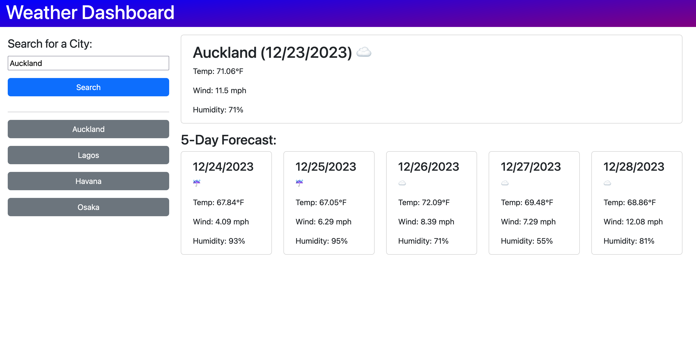

# Weather Dashboard

## Description

This project is a weather dashboard app that allows users to view the current weather and a 5-day weather forecast in nearly any city of their choosing. Additionally, the app stores the user's search history, allowing them to quickly reload the weather conditions in a previously requested city. This project utilizes weather APIs provided by OpenWeather for its main functionality. The localStorage web API is used to store the user's search history. Additionally, Bootstrap is used for the HTML/CSS layout of the page, and day.js is used for handling dates and times.

The project consists of the index.html file containing all the HTML code, the style.css file containing all the custom CSS code, and the script.js file containing all the custom JavaScript code. This README.md file describes the project, and the screenshot.png image is used in this README to illustrate how the app should appear.

While completing this project, I learned the importance of knowing how to work with asynchronous functions in JavaScript. One bug that I ran into was that I was trying to display the weather data to the page after fetching it from the API, but the call to display the data was happening before the data was fetched, even though it appeared later in the code. Of course, it turns out this was happening because the fetch call was asynchronous, and thus didn't have to complete before the code reached the call to display. By adding the display call in the .then() chain following the fetch call, the desired behavior was achieved.

## Installation

N/A

## Usage

To view the page, navigate to https://spencersurface.github.io/weather-dashboard in your web browser.

To find the current weather and weather forecast in a city, type the city's name in the search bar, then click on the "Search" button. If the city is recognized by the OpenWeather geocoding API, the weather and forecast for the city will appear on the screen, and the city will be added to the search history. To find the weather in one of the cities in the search history, click on the button labelled with that city's name, and the weather and forecast for that city will display again.

Here is a screenshot demonstrating how the page should appear: 

## Credits

This project consists almost entirely of code written by myself. The layout of the page was visually modelled after an example layout provided by edX Boot Camps LLC. Some of the code in the index.html file was initially copied from getbootstrap.com before being modified to suit my needs, otherwise all code is my own original work.

## License

No license at this time.